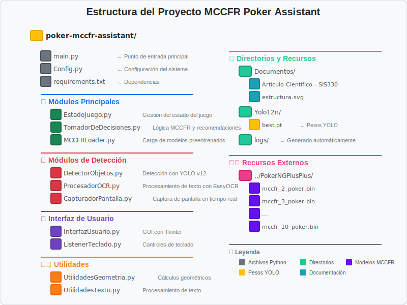

# 🎰 Asistente Inteligente de Póker MCCFR

<div align="center">


**Sistema de asistencia en tiempo real para Texas Hold'em basado en teoría de juegos**

[📖 Artículo Científico](./Documentos/Artículo%20Científico%20-%20SIS330) | [🎥 Video Demo](https://drive.google.com/drive/folders/16HYjuCk00rNIjWUdkB-jD88990FDGacn) | [📦 Recursos](https://drive.google.com/drive/folders/1VIMWPVC0bHLpkHRsCgQa2_uiCjrhgV2v?usp=drive_link)

</div>

---

## 👨‍💻 Autor

**Gabriel Aparicio Llanquipacha**  
🎓 Ingeniería en Ciencias de la Computación  
🏛️ Universidad San Francisco Xavier de Chuquisaca (USFX)  
📍 Sucre, Bolivia

---

## 🚀 Descripción

Sistema inteligente que utiliza **Monte Carlo Counterfactual Regret Minimization (MCCFR)** para proporcionar recomendaciones estratégicas óptimas en Texas No-Limit Hold'em. Combina visión por computadora, OCR y teoría de juegos para análisis en tiempo real.

### 🧠 ¿Qué es MCCFR?

MCCFR es una variante optimizada del algoritmo CFR que utiliza muestreo Monte Carlo para reducir la carga computacional. Converge hacia estrategias de equilibrio de Nash a través de millones de iteraciones de autojuego.

## ✨ Características

| Característica | Descripción |
|---|---|
| 🎯 **Detección Automática** | YOLO v12 para reconocimiento visual |
| 📝 **OCR Avanzado** | Extracción de texto de cartas y apuestas |
| 🎲 **Estrategia GTO** | 2.4M+ infosets preentrenados |
| 👥 **Multi-jugador** | Soporte para 2-10 jugadores |
| ⚡ **Tiempo Real** | Recomendaciones instantáneas |
| 🎨 **Interfaz Intuitiva** | GUI con recomendaciones en español |

---

## 📁 Estructura del Proyecto



---

## 🛠️ Instalación Rápida

### 1️⃣ Clonar y configurar
```bash
git clone [URL_REPOSITORIO]
cd poker-mccfr-assistant
python -m venv venv
source venv/bin/activate  # Windows: venv\Scripts\activate
pip install -r requirements.txt
```

### 2️⃣ Descargar recursos

| Recurso | Enlace | Destino |
|---------|--------|---------|
| 🧠 **Modelos MCCFR** | [Repositorios](https://drive.google.com/drive/folders/1VIMWPVC0bHLpkHRsCgQa2_uiCjrhgV2v?usp=drive_link) | `../PokerNGPlusPlus/` |
| 👁️ **Pesos YOLO** | [Pesos](https://drive.google.com/drive/folders/1h1FXNBSRxMy_KMFNT4moZungN9h7ynzd) | `./Yolo12n/best.pt` |

### 3️⃣ Ejecutar
```bash
python main.py
```

---

## 🎮 Uso

### Controles
| Tecla | Acción |
|-------|--------|
| `Q` | Salir |
| `P` | Pausar/Reanudar |
| `F` | Forzar recomendación |

### Interfaz
- 🎯 **Recomendación**: Acción óptima según MCCFR
- 💰 **Monto**: Cantidad exacta de apuesta
- 📊 **Confianza**: Probabilidad de la recomendación
- 🃏 **Infoset**: Estado actual analizado

---

## 📊 Resultados

- ✅ **2.4M+ infosets** explorados
- ✅ **Tasa ganancia positiva** vs Slumbot
- ✅ **1B manos** de entrenamiento
- ✅ **Tiempo real** < 1s respuesta

---

## 🤝 Contribuir

Las contribuciones son bienvenidas. Por favor:

1. Fork el proyecto
2. Crea una rama (`git checkout -b feature/nueva-caracteristica`)
3. Commit (`git commit -m 'Agregar característica'`)
4. Push (`git push origin feature/nueva-caracteristica`)
5. Abre un Pull Request

---

## 📄 Licencia

Este proyecto está bajo la Licencia MIT - ver el archivo [LICENSE](LICENSE) para detalles.

```
MIT License

Copyright (c) 2024 Gabriel Aparicio Llanquipacha

Permission is hereby granted, free of charge, to any person obtaining a copy
of this software and associated documentation files (the "Software"), to deal
in the Software without restriction, including without limitation the rights
to use, copy, modify, merge, publish, distribute, sublicense, and/or sell
copies of the Software, and to permit persons to whom the Software is
furnished to do so, subject to the following conditions:

The above copyright notice and this permission notice shall be included in all
copies or substantial portions of the Software.

THE SOFTWARE IS PROVIDED "AS IS", WITHOUT WARRANTY OF ANY KIND, EXPRESS OR
IMPLIED, INCLUDING BUT NOT LIMITED TO THE WARRANTIES OF MERCHANTABILITY,
FITNESS FOR A PARTICULAR PURPOSE AND NONINFRINGEMENT. IN NO EVENT SHALL THE
AUTHORS OR COPYRIGHT HOLDERS BE LIABLE FOR ANY CLAIM, DAMAGES OR OTHER
LIABILITY, WHETHER IN AN ACTION OF CONTRACT, TORT OR OTHERWISE, ARISING FROM,
OUT OF OR IN CONNECTION WITH THE SOFTWARE OR THE USE OR OTHER DEALINGS IN THE
SOFTWARE.
```

---

## 📚 Referencias

- [📖 Artículo Científico Completo](./Documentos/Artículo%20Científico%20-%20SIS330)
- [🎥 Video Demostrativo](https://drive.google.com/drive/folders/16HYjuCk00rNIjWUdkB-jD88990FDGacn)
- [📦 Recursos Adicionales](https://drive.google.com/drive/folders/1VIMWPVC0bHLpkHRsCgQa2_uiCjrhgV2v?usp=drive_link)

---

<div align="center">

**Desarrollado con ❤️ por Gabriel Aparicio Llanquipacha**  
🏛️ Universidad San Francisco Xavier de Chuquisaca (USFX)

</div>